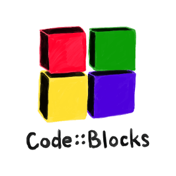

<h1 align="center">NICE TO MEET YOU!</h1>

  

  
  
  

 

  <code>
  I'm Angus Gao, a Competitive programmer and AI researcher. I am a 3th year undergrad student at HEBNU, majoring in Software Engineering (<strong>SE</strong>). I have a great passion in <strong>Problem Solving and Natural Language Processing Research</strong>. </code>

 
 ✇ <b>Research Area</b>: 

 
<h2 align="center">RESEARCH</h2>

  
   
  
  
    

 

 
 ✇ <b>Skills</b>: 

 
<h2>
  <code>
    Preferred Languages
  </code>
</h2>
 

  
  
  
  
  

 

<h2>
  <code>
    Integrated Development Environment(IDE)
  </code>
</h2>

 

  
  
  
  
  
  

<h2>
  <code>
    Database
  </code>
</h2>

 

 
 
 

<h2>
  <code>
    Tools Used
  </code>
</h2>

 
 
 
 

 

 
 ✇ <b>Current Status</b>: 

 
- 🌱 I’m currently working on <code>Natural Language Processing Toolkit (foolnltk) and A Startup Project </code>  
- 🤝 I’m looking for help in <code>Bert-pytorch </code>  
- 📫 I'm learning <code>Shell, Go and Ruby </code>  
- 👯 I'm preparing for  <code> internships and further studies</code>  
- 🕸️ Ask me about <code> Problem Solving and Deep learning </code>  
- 🌀 Trying to blog at <code> github </code>  
- 💬 You can reach me <code>19831122880@163.com </code>  
- ⚡  Sport: Jogging, Basketball ,PingPong and Marathon

 
 ✇ <b>My Github Stats</b>: 

 

  
  

 

